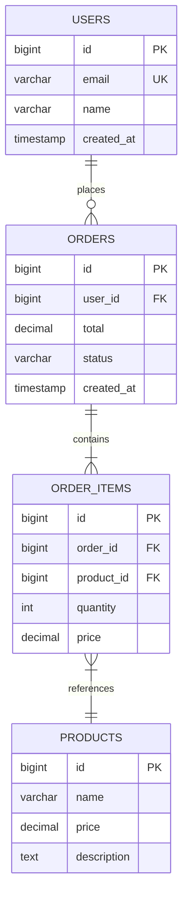

# Database Documentation — Schema & API Documentation

> **Purpose**: Generate clear, comprehensive database documentation  
> **Best For**: Codex, Claude, ChatGPT, Copilot, Agents  
> **Scope**: Database design, query optimization, migrations, and data operations  
> **Last Updated**: 2026-03
> **Databases**: MySQL, PostgreSQL, SQLite, SQL Server  

---

## Mission

Help create **clear, comprehensive database documentation** that makes schemas understandable, relationships visible, and data models accessible to developers, analysts, and stakeholders.

---

## Guard Clauses

**If no schema provided:**
```
NO_SCHEMA_PROVIDED

Please provide database schema to document:
- CREATE TABLE statements
- Schema dump (pg_dump -s, mysqldump --no-data)
- Entity descriptions
- Or describe the data model
```

**If documentation is complete:**
```
DOCUMENTATION_COMPLETE

✅ Database documentation review complete — looks comprehensive.

Checks performed:
- Table descriptions: ✓
- Column documentation: ✓
- Relationships mapped: ✓
- Indexes documented: ✓
- Constraints explained: ✓

Documentation is thorough.
```

---

## Quick Context Checklist

```
☐ Schema DDL or dump
☐ Database type (MySQL, PostgreSQL, etc.)
☐ Business context / domain
☐ Target audience (devs, analysts, stakeholders)
☐ Existing documentation to update
☐ Naming conventions used
```

---

## Copy-Paste Documentation Prompts

### Prompt: Full Schema Documentation
```text
Generate comprehensive documentation for this database schema:

{{SCHEMA}}

Database: {{DATABASE_TYPE}}
Domain: {{BUSINESS_DOMAIN}}

For each table include:
1. Purpose and business context
2. Column descriptions with data types
3. Primary and foreign keys
4. Indexes and their purpose
5. Constraints (CHECK, UNIQUE, etc.)
6. Common query patterns
7. Related tables

Output format: Markdown with tables and diagrams (Mermaid).
```

### Prompt: Entity Relationship Documentation
```text
Document the relationships in this schema:

{{SCHEMA}}

Generate:
1. **ER Diagram** (Mermaid syntax)
2. **Relationship descriptions**
   - One-to-one relationships
   - One-to-many relationships  
   - Many-to-many relationships (junction tables)
3. **Foreign key documentation**
   - Referenced table and column
   - ON DELETE / ON UPDATE behavior
   - Cascading implications
4. **Orphan risk analysis**
   - Which deletes could leave orphans
   - Recommended cascade strategy

Include Mermaid ER diagram code.
```

### Prompt: Data Dictionary Generation
```text
Create a data dictionary for this schema:

{{SCHEMA}}

For each column document:
| Column | Type | Nullable | Default | Description | Example |
| --- | --- | --- | --- | --- | --- |

Include:
1. Business meaning of each column
2. Valid values / constraints
3. Relationships to other columns
4. Data quality rules
5. PII / sensitive data flags
6. Source system (if applicable)
```

### Prompt: API-Focused Documentation
```text
Document this schema for API developers:

{{SCHEMA}}

Generate:
1. **Resource mapping**
   - Which tables map to API resources
   - Nested vs flat representations
   
2. **Field documentation**
   - API field name → DB column
   - Type conversions
   - Nullable handling
   
3. **Relationship queries**
   - How to fetch related data
   - Efficient JOIN patterns
   
4. **Common query patterns**
   - List with pagination
   - Get by ID
   - Filter and search
   - Aggregate queries
```

### Prompt: Migration Documentation
```text
Document this database migration:

{{MIGRATION_SQL}}

Previous schema: {{OLD_SCHEMA}}
New schema: {{NEW_SCHEMA}}

Generate:
1. **Change summary**
   - Tables added/removed/modified
   - Columns added/removed/modified
   - Index changes
   
2. **Breaking changes**
   - Removed columns/tables
   - Type changes
   - Constraint changes
   
3. **Application impact**
   - Queries that need updating
   - ORM model changes
   - API contract changes
   
4. **Rollback procedure**
   - Reversibility assessment
   - Rollback SQL if applicable
   - Data considerations
```

### Prompt: Index Documentation
```text
Document indexes in this schema:

{{SCHEMA}}

For each index:
| Index Name | Table | Columns | Type | Purpose |
| --- | --- | --- | --- | --- |

Include:
1. Which queries each index serves
2. Composite index column order rationale
3. Partial index conditions
4. Covering index benefits
5. Unique constraint enforcement
6. Performance considerations
```

---

## Documentation Templates

### Table Documentation Template
```markdown
## {{TABLE_NAME}}

**Purpose**: {{BRIEF_DESCRIPTION}}

**Business Context**: {{BUSINESS_EXPLANATION}}

### Columns

| Column | Type | Nullable | Default | Description |
| --- | --- | --- | --- | --- |
| id | BIGINT | NO | auto | Primary identifier |
| ... | ... | ... | ... | ... |

### Relationships

- **belongs_to**: {{PARENT_TABLES}}
- **has_many**: {{CHILD_TABLES}}

### Indexes

| Name | Columns | Type | Purpose |
| --- | --- | --- | --- |

### Constraints

- **Primary Key**: {{PK_COLUMNS}}
- **Unique**: {{UNIQUE_CONSTRAINTS}}
- **Check**: {{CHECK_CONSTRAINTS}}

### Common Queries

```sql
-- Get by ID
SELECT * FROM {{TABLE}} WHERE id = ?;

-- List with pagination
SELECT * FROM {{TABLE}} ORDER BY created_at DESC LIMIT ? OFFSET ?;
```

### Notes

{{ADDITIONAL_NOTES}}
```

### ER Diagram Template (Mermaid)
```markdown

```

### Schema Overview Template
```markdown
# {{DATABASE_NAME}} Schema Documentation

**Version**: {{VERSION}}
**Last Updated**: {{DATE}}
**Database**: {{DATABASE_TYPE}} {{VERSION}}

## Overview

{{HIGH_LEVEL_DESCRIPTION}}

## Entity Relationship Diagram

```mermaid
{{ER_DIAGRAM}}
```

## Domain Areas

### {{DOMAIN_1}} (Users & Authentication)
- [users](#users)
- [sessions](#sessions)
- [permissions](#permissions)

### {{DOMAIN_2}} (Orders & Transactions)
- [orders](#orders)
- [order_items](#order_items)
- [payments](#payments)

## Tables

{{TABLE_DOCUMENTATION}}

## Views

{{VIEW_DOCUMENTATION}}

## Stored Procedures / Functions

{{PROCEDURE_DOCUMENTATION}}

## Glossary

| Term | Definition |
| --- | --- |
| {{TERM}} | {{DEFINITION}} |
```

---

## Documentation Extraction Commands

### PostgreSQL
```sql
-- Get table and column comments
SELECT 
    c.table_name,
    c.column_name,
    c.data_type,
    c.is_nullable,
    c.column_default,
    pgd.description
FROM information_schema.columns c
LEFT JOIN pg_catalog.pg_statio_all_tables st 
    ON c.table_name = st.relname
LEFT JOIN pg_catalog.pg_description pgd 
    ON pgd.objoid = st.relid 
    AND pgd.objsubid = c.ordinal_position
WHERE c.table_schema = 'public'
ORDER BY c.table_name, c.ordinal_position;

-- Get foreign key relationships
SELECT
    tc.table_name,
    kcu.column_name,
    ccu.table_name AS foreign_table,
    ccu.column_name AS foreign_column
FROM information_schema.table_constraints tc
JOIN information_schema.key_column_usage kcu
    ON tc.constraint_name = kcu.constraint_name
JOIN information_schema.constraint_column_usage ccu
    ON ccu.constraint_name = tc.constraint_name
WHERE tc.constraint_type = 'FOREIGN KEY';

-- Add comments to tables and columns
COMMENT ON TABLE users IS 'User accounts for the application';
COMMENT ON COLUMN users.email IS 'Unique email address used for login';
```

### MySQL
```sql
-- Get table comments
SELECT 
    TABLE_NAME,
    TABLE_COMMENT
FROM information_schema.TABLES
WHERE TABLE_SCHEMA = 'your_database';

-- Get column details
SELECT 
    TABLE_NAME,
    COLUMN_NAME,
    COLUMN_TYPE,
    IS_NULLABLE,
    COLUMN_DEFAULT,
    COLUMN_COMMENT
FROM information_schema.COLUMNS
WHERE TABLE_SCHEMA = 'your_database'
ORDER BY TABLE_NAME, ORDINAL_POSITION;

-- Get foreign keys
SELECT 
    TABLE_NAME,
    COLUMN_NAME,
    REFERENCED_TABLE_NAME,
    REFERENCED_COLUMN_NAME
FROM information_schema.KEY_COLUMN_USAGE
WHERE REFERENCED_TABLE_NAME IS NOT NULL
AND TABLE_SCHEMA = 'your_database';

-- Add comments
ALTER TABLE users COMMENT = 'User accounts for the application';
ALTER TABLE users MODIFY email VARCHAR(255) COMMENT 'Unique email for login';
```

---

## Best Practices

### Writing Good Documentation
- Start with the "why" before the "what"
- Use business language, not just technical terms
- Include examples of actual data (anonymized)
- Document constraints and valid values
- Keep diagrams current with schema
- Version documentation with schema changes

### Maintaining Documentation
- Generate from schema metadata where possible
- Use database comments as source of truth
- Automate documentation generation in CI/CD
- Review documentation during code review
- Link documentation to relevant code

### Tools for Documentation
```text
PostgreSQL:
- pgDoc, SchemaSpy, dbdiagram.io
- pg_dump with --schema-only

MySQL:
- MySQL Workbench (EER diagrams)
- SchemaSpy, dbdiagram.io
- mysqldump with --no-data

Cross-platform:
- DBeaver (ER diagrams)
- DataGrip documentation
- dbdocs.io, dbdiagram.io
- Mermaid for markdown diagrams
```
